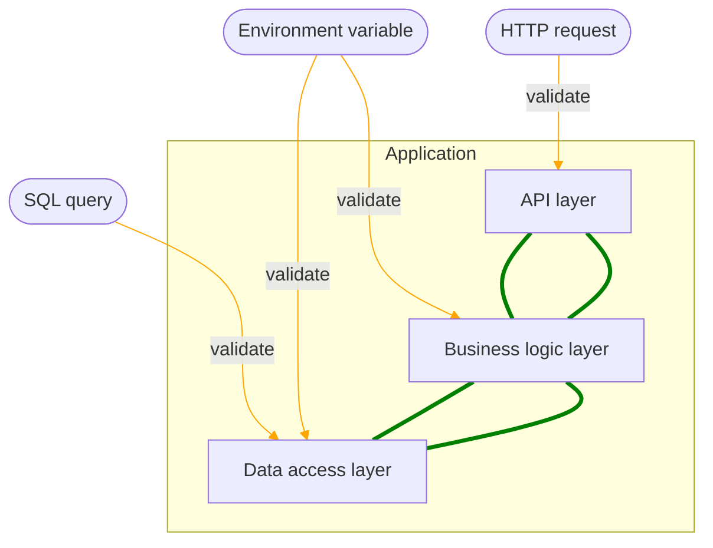

# Best of TypeScript compiler options

Let's have a look at the the TypeScript compiler options you can set inside your `tsconfig.json`. While workspace management tools such as Nx free us developers from setting up the TypeScript toolchain (which can be a real time sink), it is still worth it to go through the multitude of compiler options to get the most out of your tooling. However, there are a crapton of options and turning on _everything_ might feel good in the moment but will only get you a bunch of `// @ts-ignore` and snarky comments from your teammates :wink: That's why the SkylineJS team assembled the most valuable compiler options in this blog post. Each option has proven over many years to increase code quality and developer productivity while not getting in the way or forcing certain patterns on the developer that have no tangible benefits.

## Motivation

<br />



<br />

While TypeScript can ensure that no runtime errors happen when passing data between the type-safe components of your application, the data might still have an "unsafe" origin. An example for an origin that cannot be validated by the TypeScript compiler is the result of an SQL query. While you can specify an interface for the result data, the SQL query might still return totally different data at runtime. This can lead to issues that are difficult to debug, so we should fix the root cause by validating that the result of the SQL query machtes the TypeScript interface. We can accomplish this by using JSON schema validation without introducing any real performance penalty (e.g., by using the `ajv` library). The same approach can and should be taken for all other unsafe sources of runtime values such as environment variables or HTTP requests.

I call this approach "end-to-end type safety". If you can rely on the runtime values to match their TypeScript interface - because you validate them when they enter your application boundary - and your application ensures the correct accessing and passing of such values using TypeScript, you pretty much eliminate all runtime errors. Of course there are always edge-cases that slip through, but you should be able to reduce the time you spend inside a debugger by 90+ percent.

## Compiler options that are worth your time

These compiler options are pretty cool and should be used in every TypeScript project! They are ordered by most to least important. You can check out the complete list of options here: https://www.typescriptlang.org/tsconfig

Here is a summary of all options that are discussed in detail below. Note that the `strict` option is a convenient shortcut to activate all of the strict type checking options:

```json
{
  "strict": true,
  "noImplicitReturns": true,
  "noFallthroughCasesInSwitch": true
}
```

### `strictNullChecks`

Strict null checks are not merely a convenient way to reduce the number of `cannot read property of undefined` errors, they are a way of living!<!-- walking through life --> Developers with `strictNullChecks` enabled have a certain spring in their step, they ooze with confidence and are generally more enlightened. A study shows that 42% of developers report an immediate increase in happiness in their work and personal life after activating `strictNullChecks` at the beginning of a new project.

On a more serious note, `strictNullChecks` indeed change the way you design your application interfaces. Firstly, it enhances code robustness by preventing common runtime errors related to null and undefined values. This strict mode forces developers to explicitly handle potentially nullable variables, reducing the likelihood of 'null reference' or 'undefined is not a function' errors. Secondly, it improves code clarity and maintainability by making it clear which variables can have nullable values, encouraging more precise type annotations and safer programming practices. This leads to better self-documentation of the code and aids in collaboration among team members. Additionally, `strictNullChecks` helps catch potential issues during development rather than in the runtime, which can save time and effort in debugging and testing phases.

### `noImplicitReturns`

This feature ensures that all code paths within a function return a value, effectively eliminating the risk of unintentional undefined returns. By enforcing explicit return statements in all branches, it promotes comprehensive error handling and clearer code logic. This not only prevents potential runtime errors but also makes code more understandable and maintainable. Developers are prompted to think critically about all possible scenarios, leading to more robust and predictable functions. The "noImplicitReturns" option enhances the safety and maintainability of TypeScript code, making it a valuable tool for writing cleaner and more dependable software.

### `noFallthroughCasesInSwitch`

This feature ensures that each case in a switch statement must end with a 'break' or a 'return' statement, preventing unintended fallthrough behavior. This enhancement enforces a more structured and intentional coding style, reducing the likelihood of hard-to-trace bugs caused by accidental fallthrough. It promotes better code organization and readability by making the developer's intentions explicit, leading to more maintainable and comprehensible code. The "noFallthroughCasesInSwitch" option significantly improves code quality and minimizes potential sources of errors, making it an excellent choice for projects where robustness and maintainability are top priorities.

### `noImplicitAny`

Enabling the "noImplicitAny" option in the TypeScript compiler offers significant advantages in terms of code safety and maintainability. This feature ensures that all variables have explicit type annotations, eliminating the common "any" type, which represents an absence of type information. By doing so, it forces developers to provide clear and specific type declarations, reducing the chances of runtime errors caused by type ambiguity. This option promotes a stronger and more predictable type system, which leads to better code documentation, improved collaboration among team members, and enhanced code readability. Furthermore, by explicitly specifying types, "noImplicitAny" aids in catching type-related issues during development, enabling developers to identify and address potential problems before they manifest as runtime errors. In essence, this option encourages a safer and more maintainable TypeScript codebase, making it a valuable choice for projects seeking to maximize code quality and minimize unexpected errors.

### `useUnknownInCatchVariables`

This option is a fairly recent addition to the TypeScript compiler (added in 4.0). It addresses the issue that you can throw _anything_ in JavaScript, so you do not know if you catched an instance of the Error class or something else. Before this option, you would have to enforce the `unknown` type via a linting rule, as errors have the `any` type by default.

The unknown type provides a safer and more flexible way to handle exceptions, as it forces developers to make explicit type assertions when accessing properties or calling methods on the caught exception. This encourages better error handling practices, reduces the risk of runtime errors, and enhances code reliability by ensuring that only well-defined operations are performed on exception objects.

## Compiler options that are not worth your time

These compiler options sound useful when you first encounter them but have proven to be more of a burden during development. They might be suitable for certain kinds of projects and development practices, so its more of a recommendation than a hard rule.

### `noUnusedLocals`

<!-- Sounds good, why would you ever declare a local variable and not use it? -->

The "noUnusedLocals" option in the TypeScript compiler is designed to help identify and eliminate unused local variables within your code. While this is generally beneficial for code cleanliness and performance, it can be seen as cumbersome for developers for the following reasons:

1. Testing and experimentation: During development and debugging, developers may temporarily add variables for testing, debugging, or experimentation purposes. Forgetting to remove these variables promptly might trigger warnings, potentially adding unnecessary overhead to the development process.

2. Code refactoring: Enforcing this option might require developers to spend time and effort refactoring their code to remove unused variables. This can be particularly challenging in large codebases, and it may introduce a risk of unintentional code changes and regressions.
