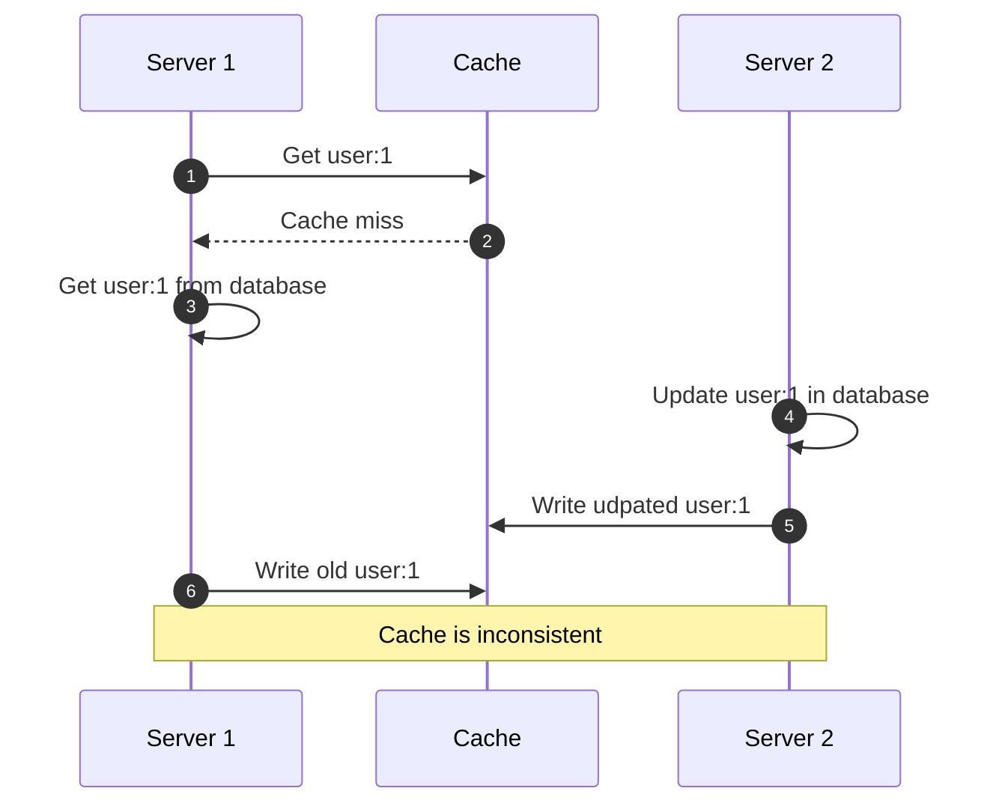
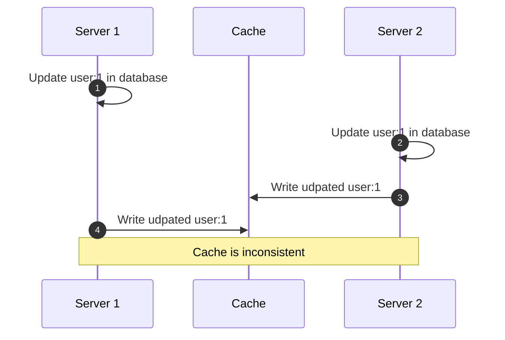

import CachingChart from '@site/src/components/CachingChart';
import CoverImage from '@site/src/components/CoverImage';

# Caching

> There are only two hard things in Computer Science: cache invalidation and managing your package.json.

Good news, we are about to solve cache invalidation. Regarding your package-lock.json merge conflicts, we send our prayers and thoughts. But why is caching so difficult? Consider this simple scenario of two servers, a database and a cache:

 

 

Server 1 wants to read `user:1` from the cache. As the user is not cached yet, he has to fetch the user from the database. To have the user cached for the next read operation, Server 1 writes the user to the cache. In the meantime, Server 2 updates the name of `user:1`. He then proceeds to write the updated user to the cache.

The diagram shows how an unfortunate timing of these operations can result in an inconsistent cache. Timing dependent bugs are hard to observe and reproduce and are therfore well suited to destroy the morale and sanity of one or more developers.

How can we protect ourselves against this scenario? A solution could be to only write to the cache if no value exists for the key. This would prevent the write operation from Server 1 to write an old value for `user:1` to the cache. However, what if the write operation of Server 1 is faster than the write operation of Server 2? In this case, a value for `user:1` would alreay exist in the cache and therefore the write operation of Server 2 would be discarded, producing an inconsistent cache again.

To solve this problem, we could always write to the cache after we perform an update operation, regardless of whether a value exists in the cache or not. Sounds good, but this just produces more problems. Consider this diagram where two servers update the same user in parallel:

 

I hope that this short thought experiment clearly demonstrates the need for a caching strategy that provides consistency regardless of the order of operations that are executed on the cache. This garantuee cannot come at the expense of the complexity of the code that needs to be written, because complex code is hard to write and even harder to test, so it will be buggy and therefore not provide a garantuee.

Enter the Skyline caching framework, that solves all of these problems while still providing a simple interface to the developer - by borrowing a trick or two from theoretical computer science.

## Caching strategy overview

<!--
TODO: interactive analytics dashboard of caching statistics
<CachingChart></CachingChart>

## Error handling

Caching is fully optional, so the cache should never cause a failure in production. At least we should be able to configure it to do so.

- Document BigInt what is necessary for stringify/ parse
- Handle storage engine failures (e.g., Redis not reachable)

-->
