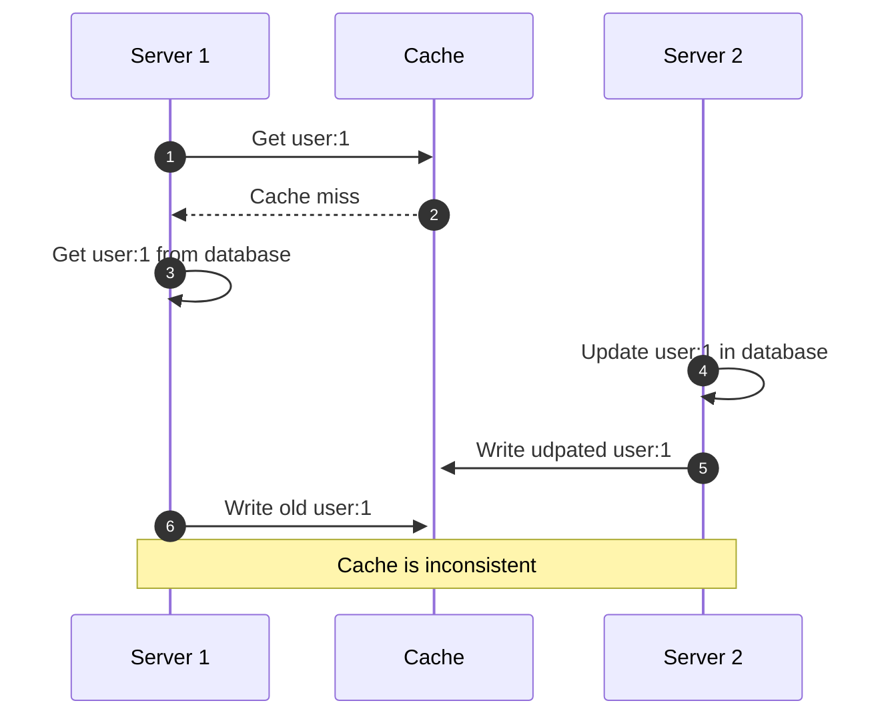

import CachingChart from '@site/src/components/CachingChart';
import CoverImage from '@site/src/components/CoverImage';

# Caching

> There are only two hard things in Computer Science: cache invalidation and managing your package.json.

Good news, we are about to solve cache invalidation. Regarding your package-lock.json merge conflicts, we send our prayers and thoughts.

But why is caching so difficult? Consider this simple scenario of two servers, a database and a cache:

<!--
TODO: interactive analytics dashboard of caching statistics
<CachingChart></CachingChart>

## Error handling

Caching is fully optional, so the cache should never cause a failure in production. At least we should be able to configure it to do so.

- Document BigInt what is necessary for stringify/ parse
- Handle storage engine failures (e.g., Redis not reachable)

-->
