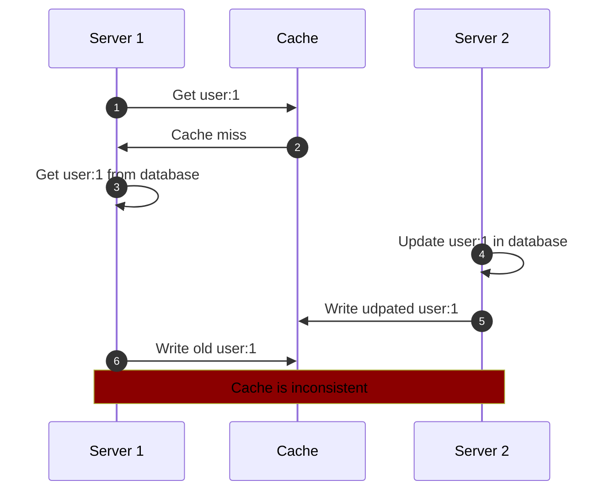
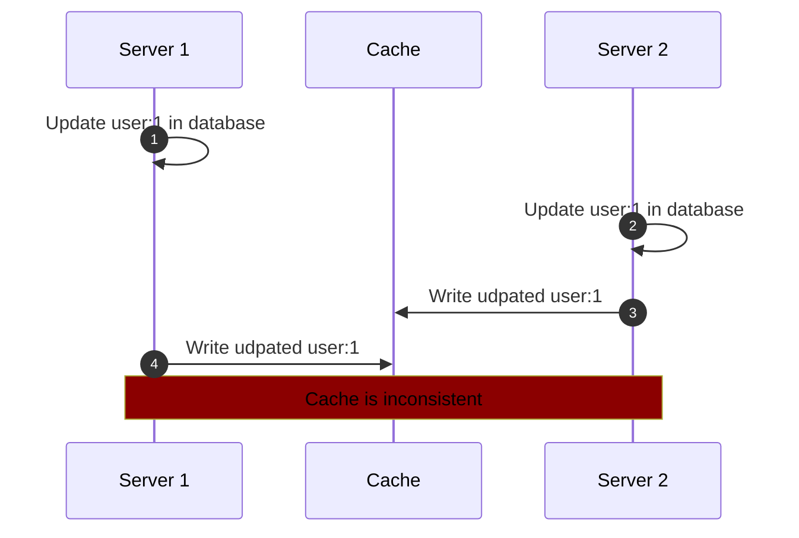
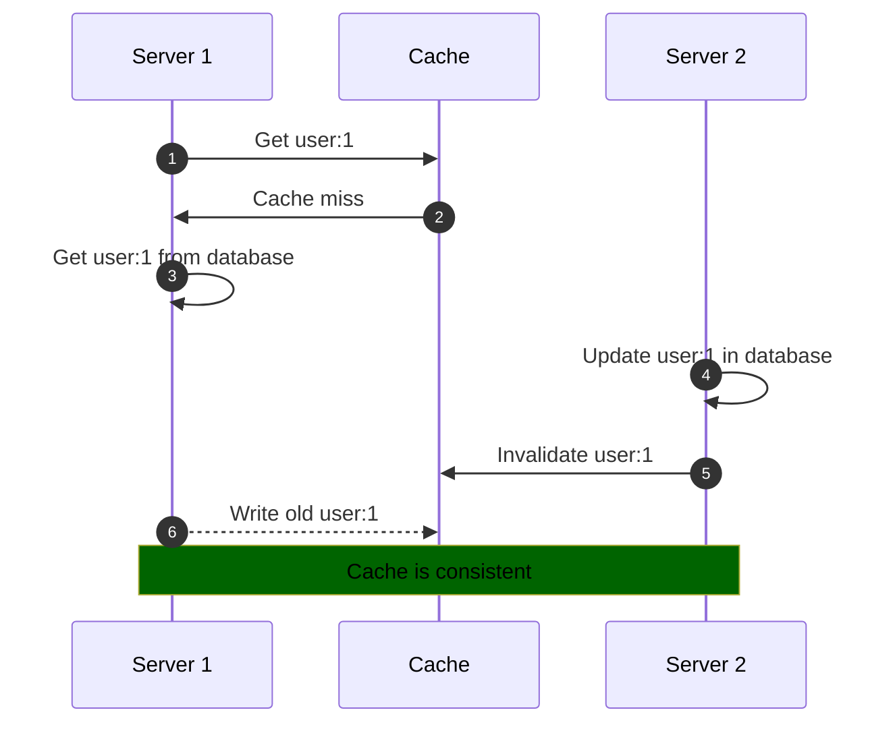
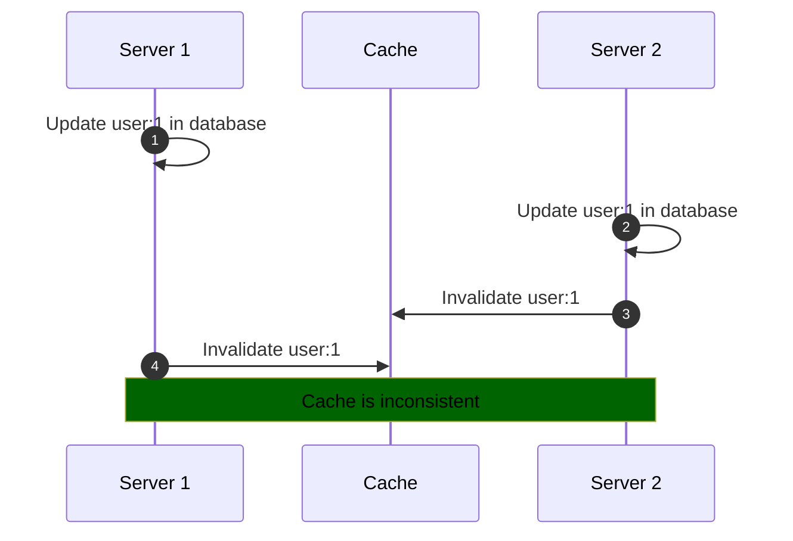

import CachingChart from '@site/src/components/CachingChart';

# Caching

> There are only two hard things in Computer Science: cache invalidation and managing your package.json.

## Introduction

Good news, we are about to solve cache invalidation. Regarding your package-lock.json merge conflicts, we send our prayers and thoughts. But why is caching so difficult? Consider this simple scenario of two servers, a database and a cache:

 

 

Server 1 wants to read `user:1` from the cache. As the user is not cached yet, he has to fetch the user from the database. To have the user cached for the next read operation, Server 1 writes the user to the cache. In the meantime, Server 2 updates the name of `user:1`. He then proceeds to write the updated user to the cache.

The diagram shows how an unfortunate timing of these operations can result in an inconsistent cache. Timing dependent bugs are hard to observe and reproduce and are therfore well suited to destroy the morale and sanity of one or more developers.

How can we protect ourselves against this scenario? A solution could be to only write to the cache if no value exists for the key. This would prevent the write operation from Server 1 to write an old value for `user:1` to the cache. However, what if the write operation of Server 1 is faster than the write operation of Server 2? In this case, a value for `user:1` would alreay exist in the cache and therefore the write operation of Server 2 would be discarded, producing an inconsistent cache again.

To solve this problem, we could always write to the cache after we perform an update operation, regardless of whether a value exists in the cache or not. Sounds good, but this just produces more problems. Consider this diagram where two servers update the same user in parallel:

 

I hope that this short thought experiment clearly demonstrates the need for a caching strategy that provides consistency regardless of the order of operations that are executed on the cache. This garantuee cannot come at the expense of the complexity of the code that needs to be written, because complex code is hard to write and even harder to test, so it will be buggy and therefore not provide a garantuee.

Enter the Skyline caching framework, that solves all of these problems while still providing a simple interface to the developer - by borrowing a trick or two from theoretical computer science.

## Caching strategy overview

The skyline caching strategy is based on the following rules:

1. Writing a value to a cache key only happens if the cache key is not set yet.
1. Writing a value to a cache key only happens if the value is not stale.
1. Invalidating a cache key sets the value to "blocked" for a certain amount of time.
1. A value retrieved for a cache key has to be validated regarding its structure.

Following these rules, no cache inconsistencies can occurr due to timing issues. However, the cache invalidation itself still needs to be done by the developer whenever a value changes. As this is very easy to forget, we furthermore need a process in place to deal with cache inconsistencies due to missing invalidations:

1. Every cache read has a probability of being skipped, which is resulting in a forced cache miss. This probability should be set to 100% for a newly introduced cache.
1. A skipped cache read results in the fetching of the value from the source of truth, followed by writing the value to the cache. The write operation fetches the cached value and compares it to the value that was fetched from the source of truth to detect an inconsistency.
1. The skip probability can be reduced with increasing confidence in the feature. However, in local development, CI and testing environments it should always be 100% to catch any inconsistencies that have been (re)introduced.

Finally, we need a strategy for minimizing the impact that a caching error has on our production system:

1. Caching has to be optional to the correct functioning of the application. If the cache throws an error, it will be identical to a cache miss for the application. Errors are always logged but catched in production - in local development, CI and testing environments always thrown.
2. A cache key consists of a namespace (e.g., `user`) and a key (e.g., `1`). If a cache inconsistency is detected, the entire namespace is disabled as the inconsistency is likely due to a systematic problem with that namespace's invalidation instead of only the individual key being affected.

 

Let's revisit the initial diagram with these rules in mind:

 

Why is the cache now consistent? Step 1 - 4 are identical, however Step 5 invalidates the cache `user:1`, which sets the value of the key to `blocked` for a certain amount of time (e.g., 1 second). This causes the cache write of the old value in Step 6 to be discarded.

You could argue: _"What if the time between Step 5 and Step 6 is longer than 1 second? In this case, the old value would still be written to the cache!"_.

This would be correct without the staleness check rule. A value is stale and will therefore be discarded when writing it to the cache if it has been fetched from the source of truth longer than a certain threshold amount of time (e.g., 1 second). In this scenario, the `fetchedAt` timestamp is recorded on Step 3, before the database is queried for the user. If the time between Step 5 and Step 6 is below 1 second, the write will be discarded because the cache key still exists (with the `blocked` value). If the time is above 1 second, the write will be discarded because the value has passed the stale threshold.

The cache inconsistencies are mitigated, let's see if the happy path of this diagram is still fullfilled: If Step 4 and 5 do not happen, the cache key `user:1` never gets blocked and therefore the correct value for `user:1` is written to the cache in Step 6. Nice!

 

Let's look at the second diagram:

 

This one is easy. The cache just gets invalidated twice, so it is obviously not inconsistent. However, an important detail here is that the second invalidation has to reset the TTL (time-to-live) of the `blocked` value for `user:1` to its configured value, otherwise the cache key's `blocked` value could expire to soon and a late write operation as depicted in the first diagram could mess up our cache afterall.

To summarize, we leverage the asymmetry of a cache key being read (a lot) and a cache key being invalidated (not so often) by blocking a cache key for some time on invalidation. While we loose using the cache during this time, we gain the garantuee of a consistent cache for the rest of cache value's lifetime. Quite a bargain if you ask me! If a cache key gets invalidated frequently, we would not be able to use the cache. However, in this case caching might be the wrong approach anyways as caching is most useful for values that do not change too often.

# Example walkthrough

<!--
Luckily, most of these rules are already implemented by the `@skyline-js/cache` library without having to
TODO: interactive analytics dashboard of caching statistics
<CachingChart></CachingChart>

## Error handling

Caching is fully optional, so the cache should never cause a failure in production. At least we should be able to configure it to do so.

- Document BigInt what is necessary for stringify/ parse
- Handle storage engine failures (e.g., Redis not reachable)

-->
