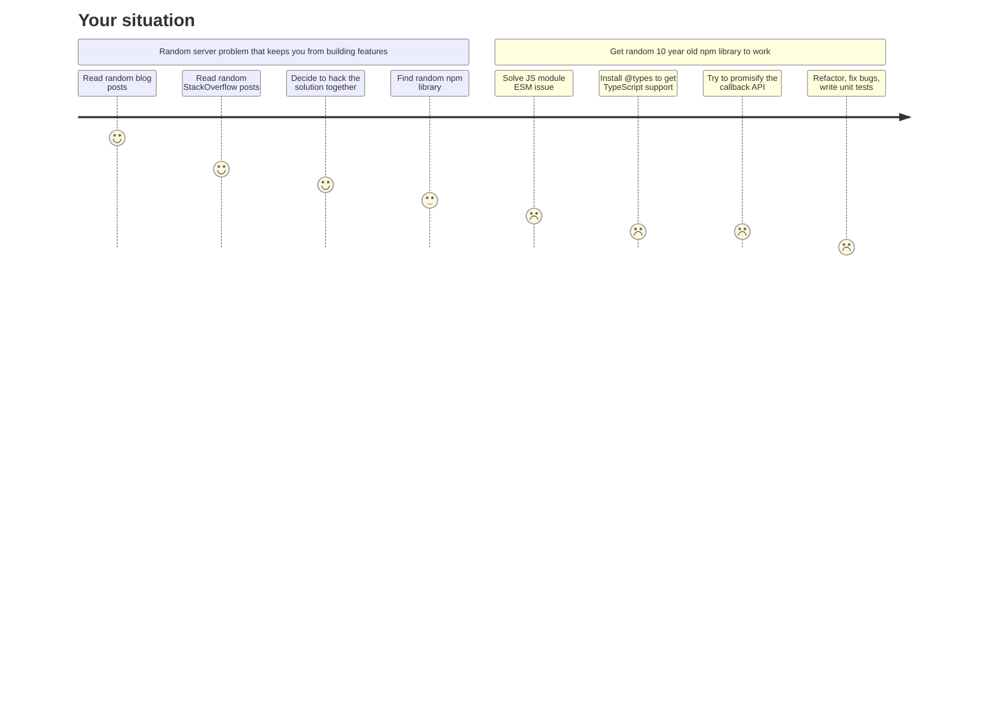

# Introduction

SkylineJS is a collection of libraries for building efficient, secure and scalable Node.js server-side applications. It is a companion toolkit to your framework of choice (e.g., NestJS), solving common tasks every server-side application has to perform such as parsing environment variables, performance monitoring or caching.

Instead of building these on your own, SkylineJS provides you with libraries that are:

- TypeScript native
- Zero or minimal dependency
- Exhaustive test coverage
- Production tested

 

Your current situation might look like this:

This is an undesirable state of existence. SkylineJS was created to guide you out of this chaos in two simple steps:

1. Education: an in-depth explanation of why you should do something a certain way.
2. Code: provide you with the necessary code to act on the knowledge you just gained.

Ideally, your framework + SkylineJS should take care of all the basic scaffolding your application needs, everything else is domain-specific functionality that depends on the particular features you would like to build (e.g., remote controlling your toaster via a REST API).

CTA: Get started or check out the architecture primer

Each Skyline library can be used on its own. However, all libraries play nicely together because they adhere to the same guiding principles. This coherence makes it easy for a developer to pick up a new Skyline library and use the same patterns to integrate the library into their own codebase. Below is a short introduction into the guiding principles.

## Complexity bad, very bad

<!-- Graphic with curve meme on developer complexity -->

If you are fresh out of university, just compiled your own version of the Arch Linux kernel and are ready to take on the world, just let me say: I understand. I used to be you and there are no words of wisdom that could have kept me from implementing abstract interfaces with 10 generics, write my own API endpoint description language for auto-generating CRUD endpoints or monkey patch npm packages at runtime to modify internal behavior I did not like (yes I know).

However, after years and years of building and maintaining a codebase that is required to create real value to real customers in the real world, I eventually learned a thing or two about code. First and foremost, code does not have an end in itself. The only raison d'être for your code is that it solves a problem for someone else. If this does not apply to your situation, you can safely close this browser tab and move on.

## Framework versus library

If you are one of those developers that uses the words "Framework" and "Library" interchangeably, stop now. A framework operates under the Hollywood principle: "Don't call us - we call you". The framework takes over the flow of the application and calls your code as needed. NestJS is an example of an excellent framework that does all the heavy lifting to create an environment you can easily develop a web server in.

SkylineJS is intentionally designed as a collection of libraries, not a framework. An application can only run a single framework. However, once you have chosen your framework, you need several libraries to solve particular problems like hashing a password or handling file uploads. A library solves one problem without any assumptions about the rest of your application. A framework does the opposite, it takes all these building blocks and is responsible for composing them into an application that achieves a goal e.g., a web server that can authenticate users.

Composition is a very delicate endeavour. It creates a lot of dependencies between the modules of your code and is therefore the most brittle part of the codebase. Furthermore, the composition is beholden to the business requirements of the application, which change more often than agile coaches their definition of the word agile. However, composing building blocks into a coherent functionality that reaches a business goal is the only reason that your application exists, so there is no way getting around it.

SkylineJS has been architected with this distinction in mind. The APIs are designed such that the developer can rely on the library to solve the problem while keeping full control and flexibility on how to integrate it into the larger picture of the application. The documentation will provide you with many examples on how to achieve this integration using your particular framework.

## Compile-time versus runtime errors

If you are not convinced that TypeScript is the best thing that happend to the JavaScript ecosystem since ..., SkylineJS is not for you. The philosophy that permeates each and every SkylineJS library is that every error that occurs at runtime but could have been detected at compile-time has to be made detectable at compile-time. The biggest productivity drain for a developer is not writing a lot of simple and repetitive code but to spend hours inside a debugger in a non-reproducible environment due to a lack of the aformentioned boring and repetitive code. Remember kids: an interface a day keeps the middle-of-the-night-production-hotfix-sessions away.

There are two ways SkylineJS reduces runtime errors to a minimum:

1. Leverage the TypeScript compiler
2. Validate runtime values and throw if they are not matching their interface

Graphic of a system boundary where everything that enters gets validated, the core is always green because it always functions under its assumptions.

## Pure functions versus side effects

<!--
Example: util functions that depend on env vars
-->

## Theoretical optimum vs lived experience

<!--
"Everybody has a plan until they get hit in the face".
Example: cache inconsistency observability strategy.
-->
